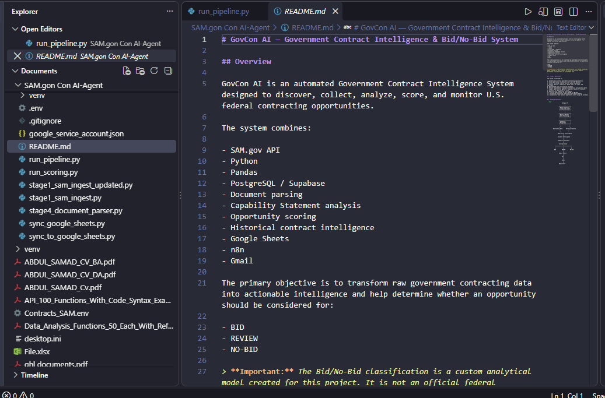
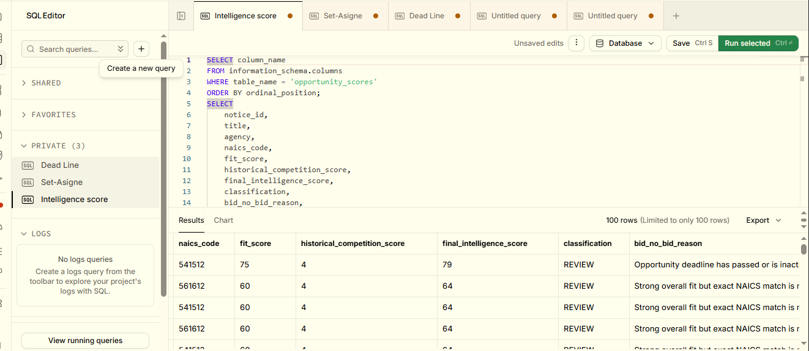
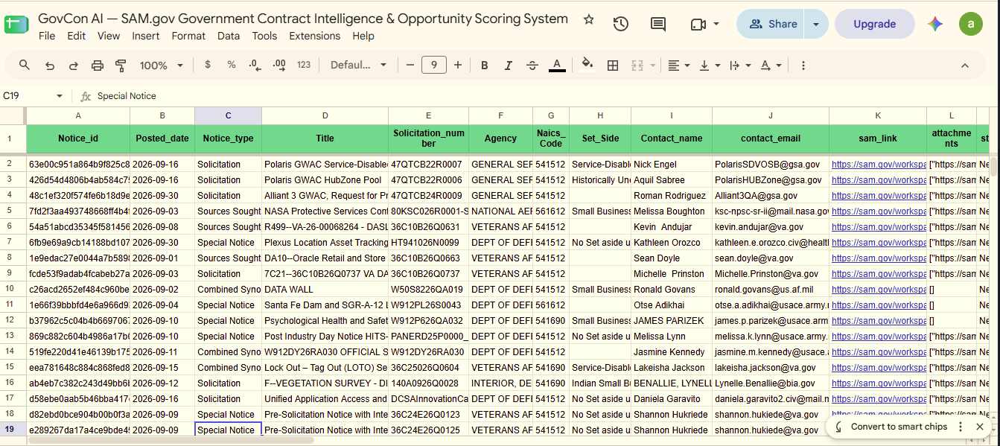

# GovCon AI — Government Contract Intelligence & Bid/No-Bid System

## Overview

GovCon AI is an automated Government Contract Intelligence System designed to discover, collect, analyze, score, and monitor U.S. federal contracting opportunities.
## Project Architecture


The system connects SAM.gov data ingestion, Python processing, Supabase/PostgreSQL, document intelligence, opportunity scoring, Google Sheets, and n8n-based email alerts.

The system combines:

- SAM.gov API
- Python
- Pandas
- PostgreSQL / Supabase
- Document parsing
- Capability Statement analysis
- Opportunity scoring
- Historical contract intelligence
- Google Sheets
- n8n
- Gmail

The primary objective is to transform raw government contracting data into actionable intelligence and help determine whether an opportunity should be considered for:

- BID
- REVIEW
- NO-BID

> **Important:** The Bid/No-Bid classification is a custom analytical model created for this project. It is not an official federal government scoring formula or procurement rule.

---

# 1. Project Objectives

The system is designed to:

1. Automatically collect government contracting opportunities.
2. Store opportunity information in a structured database.
3. Collect historical federal contract award information.
4. Analyze agencies, competitors, NAICS codes, PSC codes, and set-asides.
5. Download and parse solicitation documents.
6. Extract requirements, compliance information, and important dates.
7. Compare opportunities against a company's capability statement.
8. Calculate an opportunity-fit score.
9. Add historical competition intelligence.
10. Classify opportunities as BID, REVIEW, or NO-BID.
11. Synchronize opportunity intelligence with Google Sheets.
12. Automatically send relevant opportunity alerts using n8n and Gmail.

---

# 2. System Architecture

```text
                         SAM.gov API
                              |
                              v
                    +-------------------+
                    | Python Ingestion  |
                    | stage1_sam_ingest |
                    +-------------------+
                              |
                              v
                    +-------------------+
                    | Pandas / Python   |
                    | Data Processing   |
                    +-------------------+
                              |
                              v
                    +-------------------+
                    | Supabase /        |
                    | PostgreSQL        |
                    +-------------------+
                       /             \
                      /               \
                     v                 v
          Opportunity Data      Historical Awards
                     \               /
                      \             /
                       v           v
                  Opportunity Intelligence
                           |
                           v
                  Document Intelligence
                           |
                           v
                  Capability Statement
                           |
                           v
                    Scoring Engine
                           |
             +-------------+-------------+
             |             |             |
             v             v             v
            BID          REVIEW        NO-BID
                           |
                           v
                    Google Sheets
                           |
                           v
                         n8n
                           |
                           v
                         Gmail
                           |
                           v
                    Email Alert
## Project Screenshots

### SAM.gov / Python Data Ingestion



### Supabase / PostgreSQL Database



### Google Sheets Opportunity Intelligence



### Project Architecture


